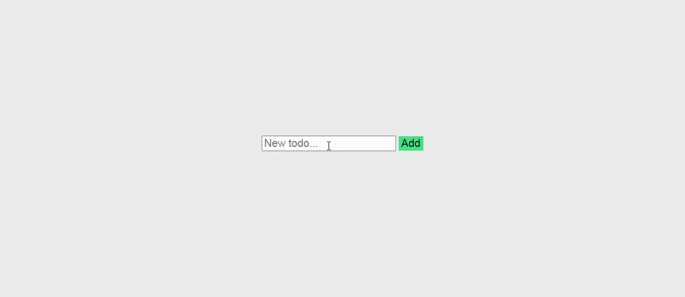

# todo-in-js
 

> Praticando

## :book: sobre
Com este exercicio de todo, consegui implementas algumas coisa que aprendi recentemente. Como desestruturação e funções de linha.

## Tecnologias
- HTML
- CSS
- JavaScript
- Node.JS

